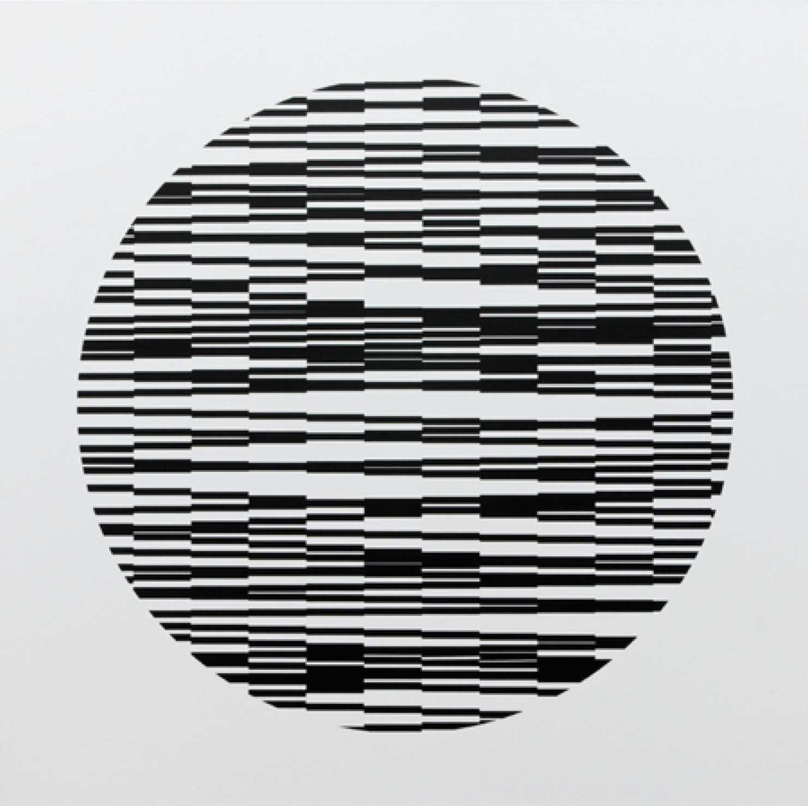
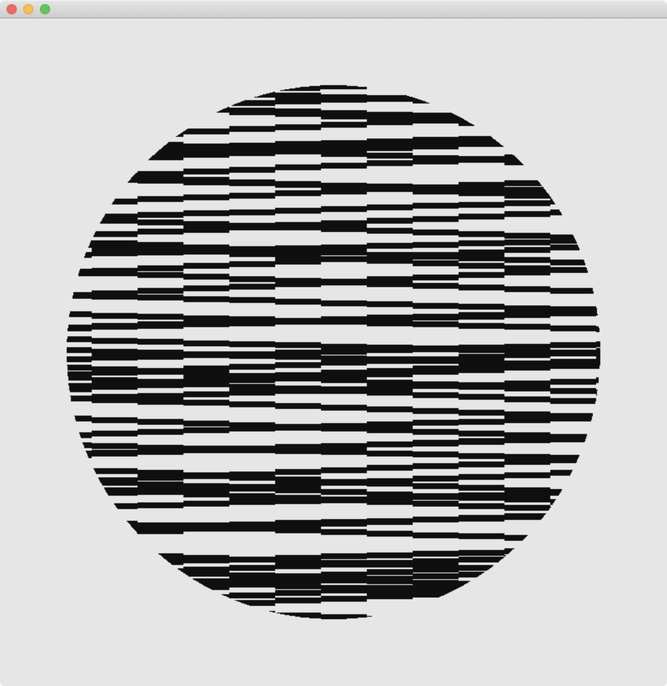
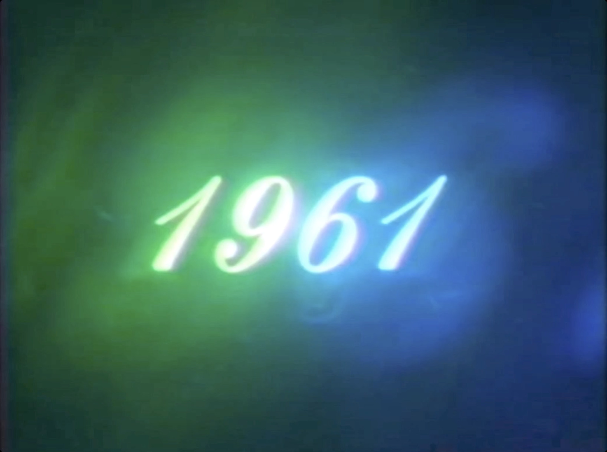
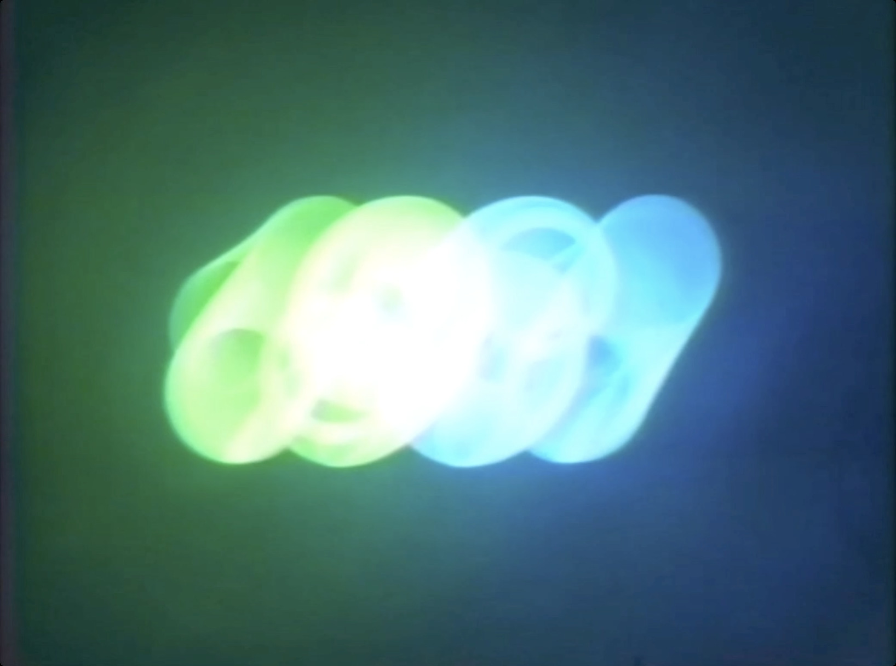
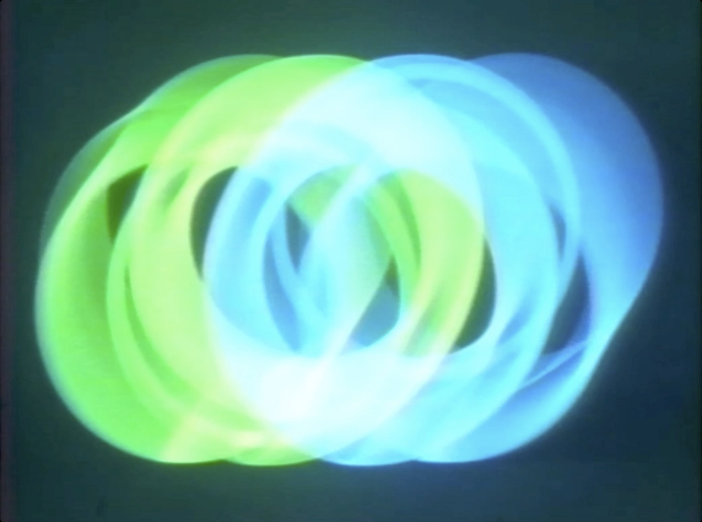
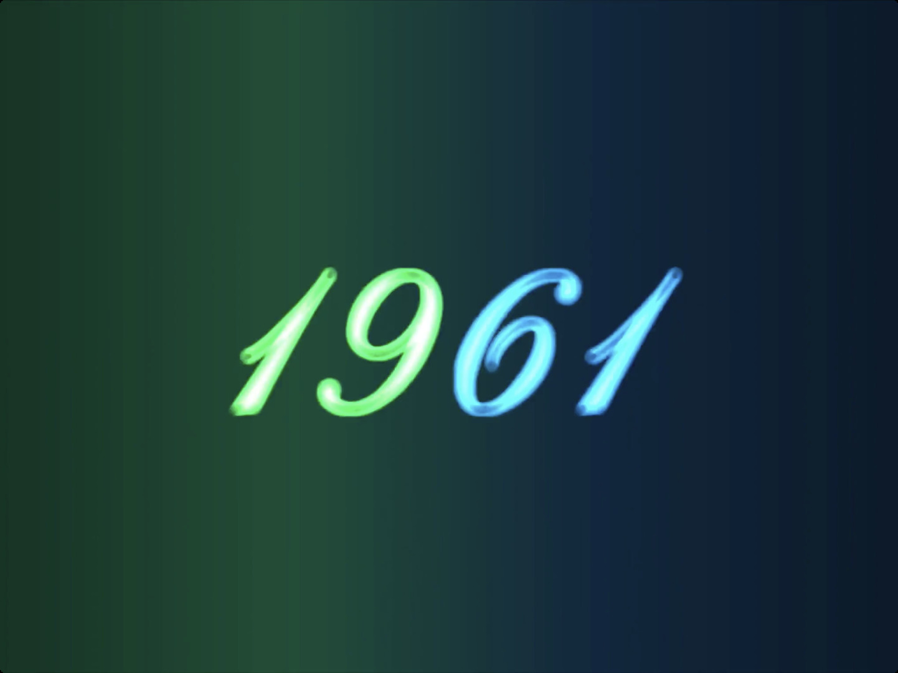
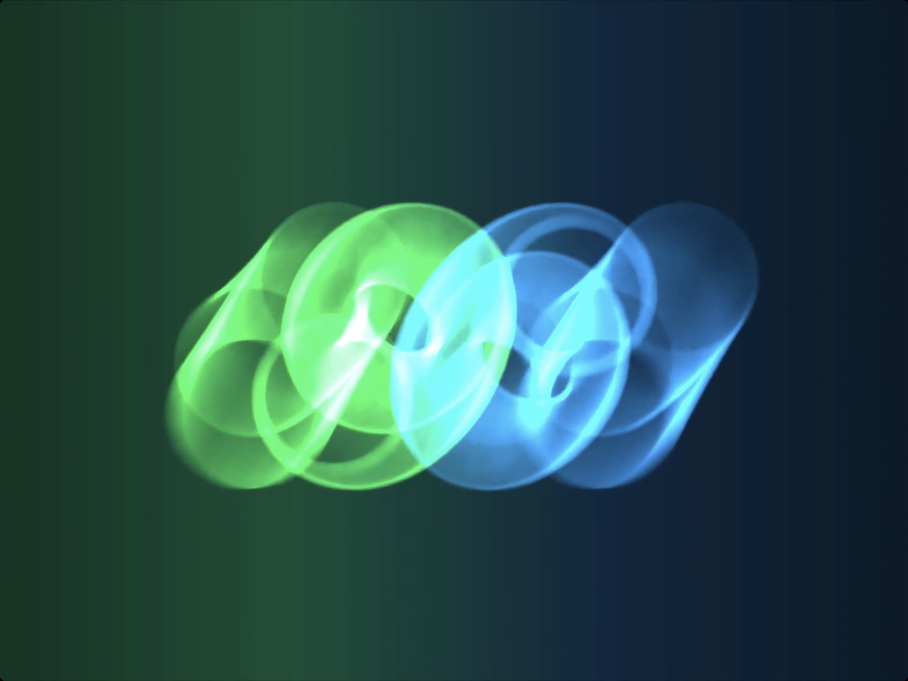
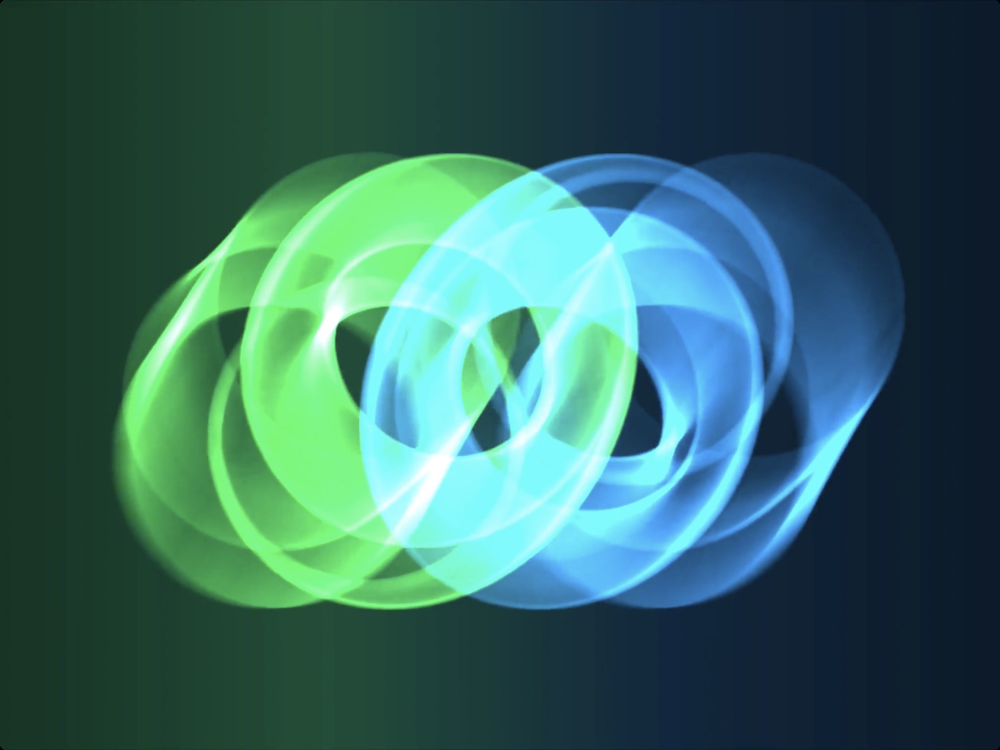
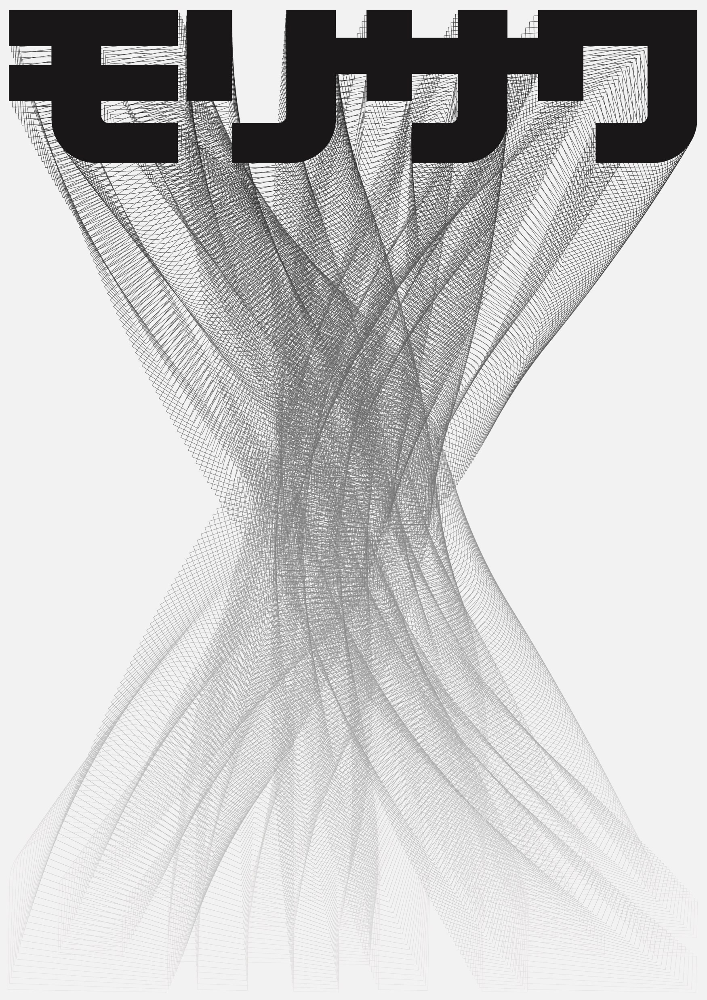
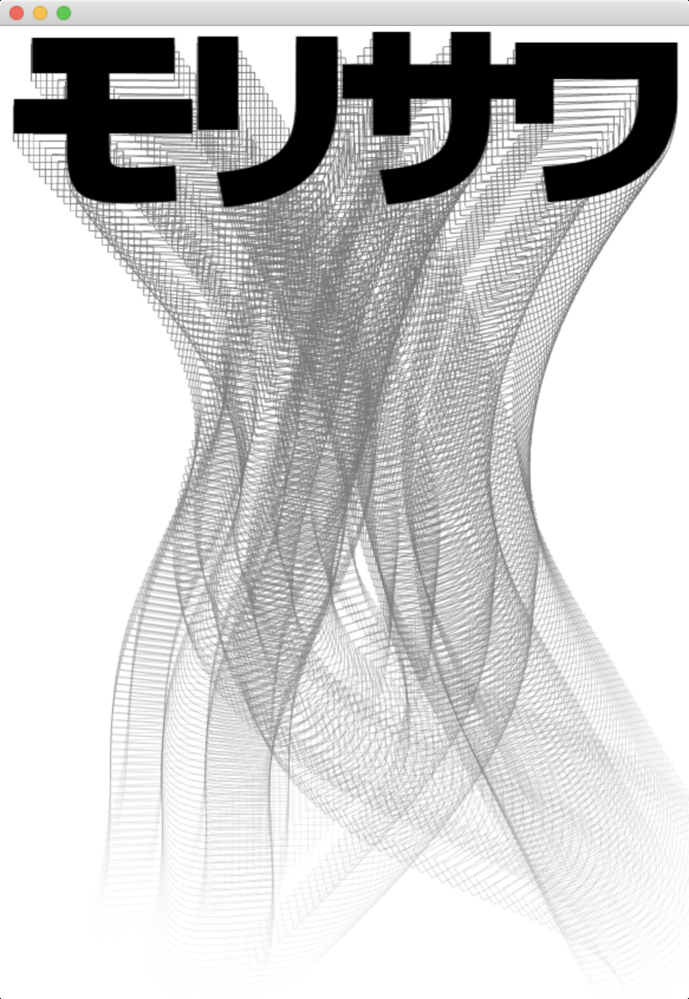

# recreating-the-past
Sketches for the Recreating the Past class at the MIT Media Lab (Fall 2019)

## Sketches

### Vera Molnar

**Original**

 

**Recreation**

### John Whitney Sr.

**Original**

**Recreation**

### John Maeda

**Original**

**Recreation**

Morisawa Poster

