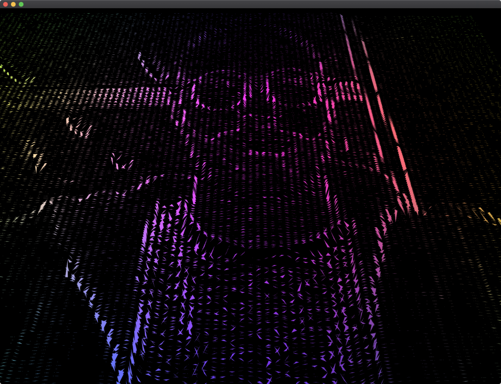

# recreating-the-past
Sketches for the Recreating the Past class at the MIT Media Lab (Fall 2019). Created in [openFrameworks](https://openframeworks.cc) v0.10.1.

## Sketches

### Vera Molnar

**Original**

**Recreation**

### John Whitney Sr.

From Catalog

**Original**

  

**Recreation**

  

### John Maeda

Morisawa Poster

**Original**

**Recreation**

### Ken Knowlton

Blob Mosaic

**Recreation**

### Lillian Schwartz

Dilating banded rectangles

**Recreation**

Noise bands

**Recreation 2**

### Nancy Burson

Blended faces

**Recreation**

### Video / Woody and Steina Vasulka 

Slit Scan + "ruttExtra" from zach repo

**Recreation**

